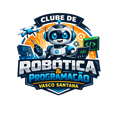

# Clube de Programação e Robótica · EB Vasco Santana

Site institucional do **Clube de Programação e Robótica** da Escola Básica Vasco Santana (Sede do Agrupamento de Escolas Vasco Santana), Ramada, Odivelas.

---

## Sobre o Projeto

Site desenvolvido para apresentar o clube à comunidade escolar — alunos do 2.º e 3.º ciclos, pais e encarregados de educação. O clube segue o lema do agrupamento **"Diferenciar para Incluir"** e promove a aprendizagem ativa nas áreas STEAM através de robótica educativa, programação visual e física.

## Estrutura do Site

| Secção | Descrição |
|---|---|
| **Hero** | Frase de impacto, CTAs e estatísticas do clube |
| **Sobre Nós** | Missão, objetivos oficiais e parcerias (LED, Ciência Viva) |
| **Projetos** | Grelha filtrável com os recursos/plataformas usados no clube |
| **Horários** | Cards por grupo com dia, hora e sala; calendário letivo |
| **Inscrições** | Passos para inscrição, tabela de horários e formulário por email |
| **Contacto** | Email, localização e horários das sessões |

## Projetos / Ferramentas em Destaque

- **Scratch** — programação visual (MIT), blocos, animações e jogos
- **LEGO Education SPIKE** — robótica modular com sensores e hub programável
- **micro:bit** — computação física (BBC), MakeCode + MicroPython, IoT

## Horários das Sessões (2025/2026)

| Grupo | Dia | Horário | Sala |
|---|---|---|---|
| Grupo 1 | Segunda-feira | 11h05 – 11h55 | LED3 |
| Grupo 2 | Terça-feira | 09h00 – 09h50 | LED1 |
| Grupo 3 | Terça-feira | 14h05 – 14h55 | LED1 |

- **1.º Semestre:** início a 4 de novembro de 2025
- **2.º Semestre:** início a 2 de março de 2026

## Contacto

**Email:** agevascosantana@gmail.com  
**Escola:** EB Vasco Santana, Ramada, Odivelas

---

## Stack Técnica

| Tecnologia | Utilização |
|---|---|
| **HTML5** | Estrutura semântica (`<main>`, `<article>`, `<time>`, `<address>`) |
| **Tailwind CSS** (CDN) | Estilização utilitária com config customizada |
| **CSS3** | Animações, light/dark mode, circuit-board pattern, scroll reveal |
| **JavaScript** (vanilla) | Interatividade sem dependências externas |
| **Google Fonts** | Inter (UI) + JetBrains Mono (código) |

Ficheiro único: `index.html` — sem build step, sem dependências npm.

## Funcionalidades

- **Dark / Light mode** com toggle 🌙/☀️ no header (desktop e mobile)
- Preferência do sistema (`prefers-color-scheme`) respeitada na 1.ª visita
- Escolha manual guardada em `localStorage`
- Script de inicialização de tema no `<head>` — sem flash de conteúdo
- **Filtro de projetos** por categoria com fade/scale animado
- **Scroll reveal** via `IntersectionObserver`
- Header transparente → sólido com blur ao fazer scroll
- Menu mobile com animação `max-height`
- Smooth scroll com offset do header fixo

## Acessibilidade (WCAG)

- Skip link "Saltar para o conteúdo principal"
- Todos os ícones decorativos com `aria-hidden="true"`
- `aria-label`, `aria-expanded`, `aria-pressed`, `role="list"` onde aplicável
- Elementos semânticos: `<address>`, `<time>`, `<nav>`, `<article>`
- `:focus-visible` com ring azul visível para navegação por teclado
- Contraste mínimo 4.5:1 em ambos os modos

## Personalização

### Substituir o logótipo
No header, substituir o `<div>` com o SVG placeholder por:
```html

```

### Adicionar uma fotografia a um card de projeto
Substituir o `<div class="h-44 ...">` pelo ``:
```html

```

### Adicionar um novo projeto
Duplicar um `<article class="project-card ...">` e ajustar:
- `data-category` — `"programacao"`, `"robotica"` ou outro
- Título, descrição e tags

## Referências

- Site original do clube: [sites.google.com/vasco-santana.edu.pt/clube-de-programao-e-robtica](https://sites.google.com/vasco-santana.edu.pt/clube-de-programao-e-robtica)
- Agrupamento de Escolas Vasco Santana: [vasco-santana.edu.pt](https://vasco-santana.edu.pt)
- LEGO Education SPIKE: [education.lego.com](https://education.lego.com)
- BBC micro:bit: [microbit.org](https://microbit.org)
- Scratch: [scratch.mit.edu](https://scratch.mit.edu)
